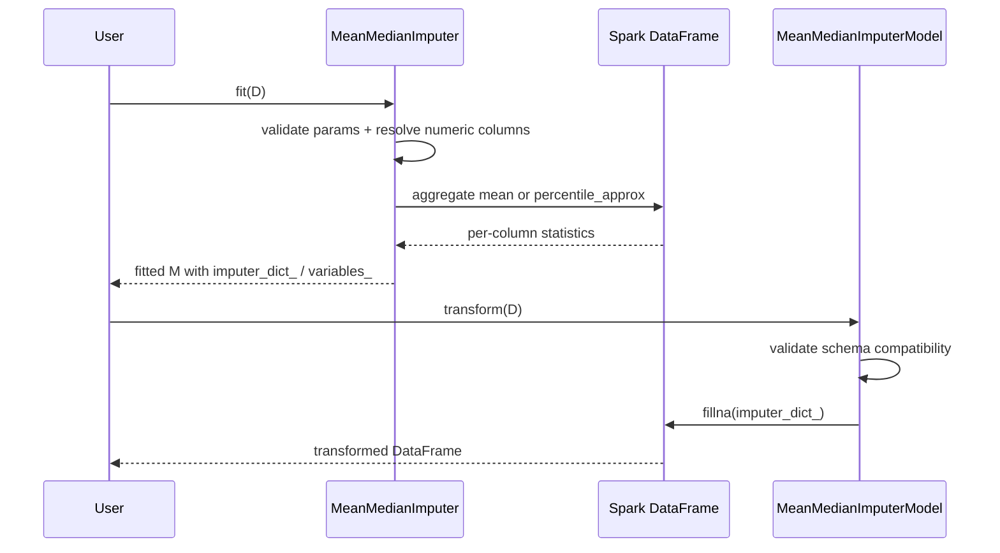
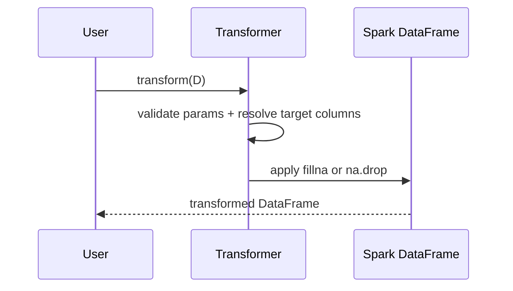

# Design: Phase 1 Foundation and Imputation

## Technical Approach
Phase 1 will create a minimal `src/`-layout Python package for `spark_feature_engine`, add repository-visible quality gates, and introduce a PySpark-native missing-data API built on `pyspark.ml` contracts. The implementation will separate stateless row/column transforms from learned imputers: stateless transformers will inherit a shared `BaseSparkTransformer`, while learned imputers will use PySpark `Estimator` -> fitted `Model` pairs that reuse the same validation and parameter conventions. All missing-data behavior will be expressed with native Spark SQL/DataFrame operations (`fillna`, `na.drop`, aggregate expressions, and percentile aggregation for median) with zero Python UDFs.

Tests will be written first for package wiring, fixture setup, parameter validation, fit/transform lifecycle, learned attributes, and column-scoped behavior. The source tree will expose a narrow public API from `spark_feature_engine.imputation` and shared internals from `spark_feature_engine.base` / `spark_feature_engine.utils`.

## Architecture Decisions

### Decision: Use `src/` layout with explicit package exports
**Choice**: Create `src/spark_feature_engine/` and `tests/` as the primary code layout, with package-level `__init__.py` files exporting only Phase 1 public classes.

**Alternatives considered**:
- Flat repository package without `src/`
- Single-module package for early bootstrap

**Rationale**: `src/` layout prevents accidental import-from-repo issues, scales cleanly into later phases, and works well with pytest, mypy, and packaging metadata.

### Decision: Split learned imputers into Estimator/Model pairs
**Choice**: Implement `MeanMedianImputer` as a PySpark `Estimator` that returns a fitted `MeanMedianImputerModel`. Keep `ArbitraryNumberImputer`, `CategoricalImputer`, and `DropMissingData` as direct `Transformer` subclasses because they do not need to learn replacement statistics from data.

**Alternatives considered**:
- Make every imputer a `Transformer`
- Make every imputer an `Estimator` even when fit is stateless

**Rationale**: This matches PySpark ML lifecycle semantics, keeps learned state on fitted objects, and avoids fake fitting for purely parameter-driven transforms.

### Decision: Standardize shared behavior through a transformer base plus validation helpers
**Choice**: Add `BaseSparkTransformer` (`Transformer`, `Params`, `DefaultParamsReadable`, `DefaultParamsWritable`) for common param access, schema checks, selected-column resolution, copy behavior, and fitted-attribute conventions; add small shared validation utilities for schema/type checks used by both transformers and estimators.

**Alternatives considered**:
- Put all validation logic directly in each class
- Introduce one large mixed base for both estimators and transformers

**Rationale**: The spec explicitly requires a shared transformer base. Keeping validation helpers separate avoids forcing estimator lifecycle behavior into a transformer-only abstraction while still centralizing rules.

### Decision: Compute median with native percentile aggregation
**Choice**: Use Spark-native percentile aggregation (`percentile_approx` via SQL functions) for median statistics during fitting.

**Alternatives considered**:
- Collect columns to Python and compute medians locally
- Use Python UDFs
- Refuse median support until an exact distributed strategy is added

**Rationale**: The spec requires native Spark execution with zero UDFs. Approximate percentile aggregation is the practical Spark-native median mechanism and is sufficient for Phase 1.

### Decision: Resolve target columns from schema at fit/transform time
**Choice**: Support `variables=None` by discovering columns from the Spark schema, validate explicit column lists eagerly, and fail before output when configured columns are missing or have incompatible data types.

**Alternatives considered**:
- Require explicit variables for all transformers
- Silently skip incompatible columns

**Rationale**: This preserves feature-engine-like ergonomics while meeting the spec requirement for validation errors on incompatible inputs.

## Data Flow

### Learned imputer flow (`MeanMedianImputer`)

### Stateless transformer flow (`ArbitraryNumberImputer`, `CategoricalImputer`, `DropMissingData`)

## File Changes

### Create
- `pyproject.toml` - package metadata; pytest, Ruff, and mypy configuration; optional dependency groups
- `src/spark_feature_engine/__init__.py` - package exports and version placeholder
- `src/spark_feature_engine/base.py` - `BaseSparkTransformer` and shared parameter helpers
- `src/spark_feature_engine/_validation.py` - schema/type/column validation utilities
- `src/spark_feature_engine/imputation/__init__.py` - imputer exports
- `src/spark_feature_engine/imputation/mean_median.py` - estimator + fitted model for learned numerical imputation
- `src/spark_feature_engine/imputation/arbitrary_number.py` - stateless numeric fill transformer
- `src/spark_feature_engine/imputation/categorical.py` - stateless categorical fill transformer
- `src/spark_feature_engine/imputation/drop_missing_data.py` - row-drop transformer for selected columns
- `tests/conftest.py` - reusable local `SparkSession` fixture
- `tests/test_base_transformer.py` - shared base/param behavior coverage
- `tests/imputation/test_mean_median.py` - learned-statistic and transform tests
- `tests/imputation/test_arbitrary_number.py` - numeric fill tests
- `tests/imputation/test_categorical.py` - default/custom fill tests
- `tests/imputation/test_drop_missing_data.py` - row-removal tests

### Modify
- None; the repository currently contains only OpenSpec artifacts.

### Delete
- None.

## Interfaces / Contracts

### `BaseSparkTransformer`
- Inherits from `pyspark.ml.Transformer` and `pyspark.ml.param.Params`
- Provides typed public helpers for:
  - reading/writing `Param` values
  - validating required params
  - resolving `variables` against a DataFrame schema
  - validating column data types (`numeric`, `string`, or `any`)
  - preserving copy/write/read compatibility expected by Spark ML components

### Shared parameters
- `variables: Param[List[str] | None]` on all Phase 1 transformers
- `MeanMedianImputer.imputation_method: Param[str]` with allowed values `mean|median`
- `ArbitraryNumberImputer.fill_value: Param[float]`
- `CategoricalImputer.fill_value: Param[str]` defaulting to `"missing"`
- `DropMissingData.missing_only: Param[bool]` for fit-time narrowing of selected columns if retained in implementation; otherwise omit to keep behavior aligned to spec-only scope

### Learned attributes
- Learned/fitted objects expose trailing-underscore attributes only:
  - `variables_`
  - `imputer_dict_`
  - any schema snapshot attribute needed for compatibility checks

### Native execution contract
- Numerical fill uses `DataFrame.na.fill` / `fillna`
- Categorical fill uses `DataFrame.na.fill`
- Row dropping uses `DataFrame.na.drop` or equivalent boolean filtering
- Median uses Spark percentile aggregation; no Python UDFs or pandas conversions

## Testing Strategy
- Write tests before implementation for each Phase 1 class.
- Use a session-scoped local Spark fixture with deterministic app name and reduced shuffle partitions.
- Cover:
  - package import surface
  - Param defaults and overrides
  - explicit and auto-discovered `variables`
  - mean vs median fitting
  - trailing-underscore learned attributes on fitted model objects
  - column-scoped behavior (non-selected columns unchanged)
  - invalid column names and invalid schema types raising errors
  - categorical default fill of `"missing"`
  - row removal for selected columns only
  - absence of UDF-based execution by constraining implementation to DataFrame/native function APIs during code review
- Run `ruff format --check`, `ruff check`, `mypy`, and `pytest` as local quality gates.

## Migration / Rollout
- No data migration is required.
- Phase 1 is additive: it introduces the initial package, tooling, and imputation API into an otherwise empty repository.
- Public API should stay small and explicit so later phases can extend package exports without breaking imports introduced here.

## Open Questions
- Whether `DropMissingData` should include feature-engine-like optional behaviors beyond the current spec (for example `threshold` or fit-time `missing_only`) should be decided during implementation scoping; the Phase 1 spec only requires dropping rows with nulls in selected columns.
- Whether to export fitted model classes publicly or keep them as implementation details behind estimator usage can be finalized during implementation, but tests must still validate their fitted attributes.
