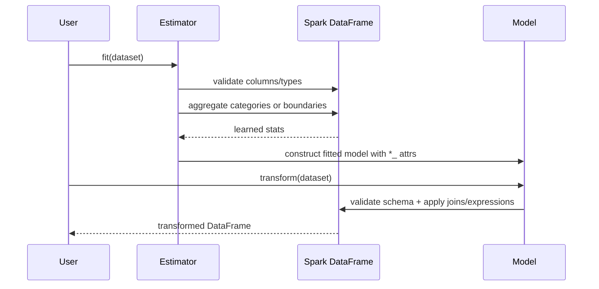

# Design: Phase 2 Encoding and Discretisation

## Technical Approach

Phase 2 will extend the existing Phase 1 Spark ML-style foundation with two new public domains: `encoding` and `discretisation`. Learned behavior will use `Estimator -> Model` pairs when fit-time statistics are required, while purely configuration-driven behavior will remain direct `Transformer` implementations.

The implementation will stay fully Spark-native:

- categorical mappings learned with `groupBy`, `count`, normalized aggregates, joins, and conditional expressions
- discretisation boundaries learned with min/max aggregation or Spark approximate quantiles
- bin assignment executed with native column expressions or Spark ML `Bucketizer`
- no Python UDFs during fit or transform

The design reuses `BaseSparkTransformer` and `_validation.py`, adding narrowly scoped shared helpers where Phase 2 needs repeated schema, parameter, collision, and learned-state checks.

## Architecture Decisions

### Decision: Separate learned estimators from stateless transformers
**Choice**: Implement `OneHotEncoder`, `OrdinalEncoder`, `CountFrequencyEncoder`, `RareLabelEncoder`, `EqualWidthDiscretiser`, and `EqualFrequencyDiscretiser` as estimators with fitted model classes; implement `ArbitraryDiscretiser` as a transformer.

**Alternatives considered**:
- Make all components transformers and compute state during `transform`
- Make all components estimators for uniformity

**Rationale**:
- The specs require learned trailing-underscore attributes when fit derives state.
- Spark ML lifecycle semantics are clearer when learned state is frozen in models.
- Arbitrary discretisation is fully parameter-driven, so forcing a learned model would add ceremony without value.

### Decision: Add Phase 2 shared validation helpers instead of duplicating resolver logic per module
**Choice**: Extend `src/spark_feature_engine/_validation.py` with reusable helpers for categorical/numeric discovery, generated-column collision checks, boundary validation, and option normalization.

**Alternatives considered**:
- Keep helper logic private inside each module
- Introduce a new internal utilities package immediately

**Rationale**:
- Phase 1 already centralizes schema validation in `_validation.py`.
- Encoding and discretisation both need repeated checks for variable resolution, allowed parameter values, and deterministic output safety.
- Centralizing these rules reduces drift across seven transformers and their fitted models.

### Decision: Learn categorical state into Python metadata but execute transforms through Spark joins/expressions
**Choice**: Persist learned mappings/categories/frequent-label sets as small public Python dictionaries/lists on the fitted model, and build Spark-native transform plans from that metadata.

**Alternatives considered**:
- Persist learned state only as Spark DataFrames
- Use Python-side row-wise mapping logic during transform

**Rationale**:
- The public API needs inspectable trailing-underscore attributes.
- Small learned metadata is practical to serialize on Spark ML objects.
- Transform-time execution can still remain distributed by turning metadata into joins or chained Spark expressions.

### Decision: Use deterministic ordering rules for learned categories and boundaries
**Choice**: Define stable fit-time ordering rules: frequency-descending/category-ascending tie breaks where ranking matters, sorted category order for arbitrary ordinal coding, and strictly ordered numeric split lists for discretisers.

**Alternatives considered**:
- Accept Spark's arbitrary partition-dependent ordering
- Preserve first-seen order from distributed input

**Rationale**:
- Specs require deterministic learned mappings across repeated fits on the same data.
- Spark aggregations do not guarantee stable ordering without explicit sort criteria.
- Determinism is also necessary for generated one-hot column naming and max-category caps.

### Decision: Standardize unseen and out-of-range handling through explicit policies
**Choice**: Encode policy params into shared helpers and model logic:

- ordinal/count-frequency unseen: `ignore`, `encode`, `raise`
- arbitrary discretiser out-of-range: `ignore`, `raise`
- one-hot unseen: always all-zero generated columns
- equal-width/equal-frequency extremes: always clipped into outer bins via infinite outer boundaries

**Alternatives considered**:
- Silent best-effort handling per transformer
- Spark defaults without explicit validation

**Rationale**:
- The specs call out policy-dependent behavior as contract surface.
- Making policy handling explicit simplifies tests and avoids accidental divergence from reference behavior.

### Decision: Preserve selected-column replacement semantics by default
**Choice**: All Phase 2 transformers will replace selected columns in place, except one-hot encoding which replaces each source column with generated columns.

**Alternatives considered**:
- Add parallel `outputCols` behavior now
- Preserve source columns and append encoded/discretised outputs

**Rationale**:
- The specs explicitly require replacement semantics.
- This matches the existing package direction from Phase 1 and the feature-engine reference.
- Deferring append-style behavior keeps Phase 2 focused and reduces collision complexity.

## Data Flow

### Encoding

1. Resolve configured variables against dataset schema.
2. Validate string compatibility, uniqueness, and transformer-specific params.
3. Fit-time learned encoders aggregate per-column category statistics.
4. Fit stores learned state on model attributes such as categories, mappings, or frequent-label sets.
5. Transform validates current schema, then:
   - `OneHotEncoder`: generate deterministic binary columns and drop source columns.
   - `OrdinalEncoder`: left join / map categories to integer codes, then enforce unseen policy.
   - `CountFrequencyEncoder`: left join / map categories to counts or frequencies, then enforce unseen policy.
   - `RareLabelEncoder`: replace non-frequent labels with configured rare label using native conditional expressions.

### Discretisation

1. Resolve numeric variables and validate configuration.
2. Fit-time discretisers learn ordered split lists:
   - equal-width via min/max aggregation and computed widths
   - equal-frequency via Spark approximate quantiles
3. Learned boundaries are stored in trailing-underscore attributes.
4. Transform uses Spark-native bucketing/conditional expressions to replace selected values with:
   - numeric bin identifiers by default
   - deterministic interval-boundary labels when configured
5. Equal-width/equal-frequency always extend outer splits to `-inf` / `inf`; arbitrary discretisation preserves configured boundaries and applies the requested out-of-range policy.

## File Changes

### Create
- `src/spark_feature_engine/encoding/__init__.py`
- `src/spark_feature_engine/encoding/one_hot.py`
- `src/spark_feature_engine/encoding/ordinal.py`
- `src/spark_feature_engine/encoding/count_frequency.py`
- `src/spark_feature_engine/encoding/rare_label.py`
- `src/spark_feature_engine/discretisation/__init__.py`
- `src/spark_feature_engine/discretisation/equal_width.py`
- `src/spark_feature_engine/discretisation/equal_frequency.py`
- `src/spark_feature_engine/discretisation/arbitrary.py`
- `tests/encoding/test_one_hot.py`
- `tests/encoding/test_ordinal.py`
- `tests/encoding/test_count_frequency.py`
- `tests/encoding/test_rare_label.py`
- `tests/discretisation/test_equal_width.py`
- `tests/discretisation/test_equal_frequency.py`
- `tests/discretisation/test_arbitrary.py`

### Modify
- `src/spark_feature_engine/__init__.py`
- `src/spark_feature_engine/base.py`
- `src/spark_feature_engine/_validation.py`

### Delete
- None planned.

## Interfaces / Contracts

- `OneHotEncoder.fit(df) -> OneHotEncoderModel`
  - learned attrs: selected variables, learned categories, generated output names
- `OrdinalEncoder.fit(df) -> OrdinalEncoderModel`
  - params: variables, encoding method/policy surface limited to approved spec behavior, unseen policy
  - learned attrs: per-variable category->code mapping
- `CountFrequencyEncoder.fit(df) -> CountFrequencyEncoderModel`
  - params: variables, encoding method (`count`/`frequency`), unseen policy
  - learned attrs: per-variable category->numeric mapping
- `RareLabelEncoder.fit(df) -> RareLabelEncoderModel`
  - params: variables, tolerance, minimum category threshold, optional max frequent categories, replacement label
  - learned attrs: per-variable retained frequent labels
- `EqualWidthDiscretiser.fit(df) -> EqualWidthDiscretiserModel`
  - params: variables, bin count, output representation
  - learned attrs: per-variable boundaries
- `EqualFrequencyDiscretiser.fit(df) -> EqualFrequencyDiscretiserModel`
  - params: variables, bin count/quantile count, output representation
  - learned attrs: per-variable boundaries
- `ArbitraryDiscretiser.transform(df) -> DataFrame`
  - params: binning dict, output representation, out-of-range policy
  - no learned state beyond configured boundaries exposed consistently

Shared contracts:

- only selected columns may change
- invalid schema/params must raise validation errors
- learned public attrs must end in `_`
- output plans must avoid `PythonUDF`, `BatchEvalPython`, and `ArrowEvalPython`

## Testing Strategy

Tests will be written before implementation in seven focused modules, plus any shared-base validation coverage needed for new helper behavior.

### Encoding tests
- fit/transform happy path for each encoder
- untouched non-selected columns
- deterministic learned state across repeated fits
- one-hot generated-column naming and collision failures
- unseen-category policies for ordinal/count-frequency
- one-hot unseen rows produce all zeros
- rare-label frequency threshold, minimum-category bypass, and max-category cap
- learned trailing-underscore attribute exposure
- native Spark plan assertions for representative transforms

### Discretisation tests
- learned boundary derivation for equal-width/equal-frequency
- transform replacement semantics and untouched non-selected columns
- outer-bin assignment for future extreme values
- arbitrary discretiser boundary inclusivity and out-of-range policy
- default numeric-bin output and boundary-label output mode
- invalid bins, unsorted boundaries, missing columns, and wrong types
- learned attrs present only for learned discretisers
- native Spark plan assertions for representative transforms

### Verification commands
- `pytest`
- `mypy src tests`
- targeted local test runs for each new module during implementation

## Migration / Rollout

- No data migration is required.
- Public rollout is additive through new exports in package `__init__` files.
- Phase 1 APIs remain unchanged aside from any safe shared-base/helper extensions.
- If a specific transformer proves unstable, the package can roll back that module family without affecting existing imputation behavior.

## Open Questions

- Whether Phase 2 should expose optional `drop_last` / top-category one-hot variants now or defer them until a later parity phase; current specs only require full learned-category expansion.
- Whether interval-boundary label formatting should use raw boundary tuples or a normalized string form; implementation should pick one deterministic representation and test it explicitly.
- Whether shared estimator/model helper base classes become worthwhile after Phase 2 lands; the initial implementation can start with focused modules and refactor later if duplication is real.
